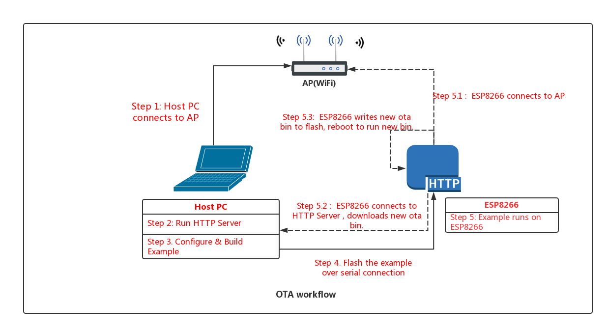

# OTA Demo

## Introduction

Over The Air (OTA) updates can be performed in esp8266 in two ways:

- Using native APIs which are part of OTA component.
- Using simplified APIs which are part of `esp_https_ota`. It is an abstraction layer over OTA APIs to perform updates using HTTPS.

Both these methods are demonstrated in OTA Demo under `native_ota_example` and `simple_ota_example` respectively.

---

## Aim

An app running on ESP8266 can upgrade itself by downloading a new app "image" binary file, and storing it in flash.

In this example, the ESP8266 has 3 images in flash: factory, OTA_0, OTA_1. Each of these is a self-contained partition. The number of OTA image partition is determined by the partition table layout.

Flashing the example over serial with "make flash" updates the factory app image. On first boot, the bootloader loads this factory app image which then performs an OTA update (triggered in the example code). The update downloads a new image from a HTTPS server and saves it into the OTA_0 partition. At this point the example code updates the ota_data partition to indicate the new app partition, and resets. The bootloader reads ota_data, determines the new OTA image has been selected, and runs it.


## Workflow

The OTA_workflow.png diagram demonstrates the overall workflow:



### Step 1: Connect to AP

Connect your host PC to the same AP that you will use for the ESP8266.

### Step 2: Generate the OTA Binary
For our upgrade example OTA file, we're going to use the `get-started/hello_world` example.

Build the example:

```
cd $IDF_PATH/examples/get-started/hello_world
make
cd build
```

Note: You've probably noticed there is nothing special about the "hello_world" example when used for OTA updates. This is because any .bin app file which is built by ESP8266_RTOS_SDK can be used as an app image for OTA. The only difference is whether it is written to a factory partition or an OTA partition.

### Step 3: Run HTTPS Server

Open a new terminal and run these commands to start the HTTPS server:

Generate self-signed certificate and key:

*NOTE: `Common Name` of server certificate should be host-name of your server.*

```
openssl req -x509 -newkey rsa:2048 -keyout ca_key.pem -out ca_cert.pem -days 365

```

Copy the certificate to `server_certs` directory inside OTA example directory:

```
cp ca_cert.pem /path/to/ota/example/server_certs/
```


Start the HTTPS server:

```
openssl s_server -WWW -key ca_key.pem -cert ca_cert.pem -port 8070
```

Copy the generated binary(hello_world.bin) into the folder in which the HTTPS server is running.  
If you have any firewall software running that will block incoming access to port 8070, configure it to allow access while running the example.

### Step 4: Build OTA Example

Change back to the OTA example directory, and type `make menuconfig` to configure the OTA example. Under the "Example Configuration" submenu, fill in the following details:

* WiFi SSID & Password
* Firmware Upgrade URL. The URL will be look like this:

```
https://<host-ip-address>:<host-port>/<firmware-image-filename>

for e.g,
https://192.168.0.3:8070/hello_world.bin
```

Save your changes, and type `make` to build the example.

### Step 5: Flash OTA Example

When flashing, use the `make flash` to flash the factory image. This command will find if partition table has ota_data partition (as in our case) then ota_data will erase to initial. 
It allows to run the newly loaded app from a factory partition.

```
make flash
```

### Step 6: Run the OTA Example

When the example starts up, it will print "Starting OTA example..." then:

1. Connect to the AP with configured SSID and password.
2. Connect to the HTTP server and download the new image.
3. Write the image to flash, and configure the next boot from this image.
4. Reboot

## Troubleshooting

### General connectivity issues

* Check your PC can ping the ESP8266 at its IP, and that the IP, AP and other configuration settings are correct in menuconfig.
* Check if any firewall software is preventing incoming connections on the PC.
* Check whether you can see the configured file (default hello_world.bin), by checking the output of following command:

 ```
 curl -v https://<host-ip-address>:<host-port>/<firmware-image-filename>
 ```

* If you have another PC or a phone, try viewing the file listing from the separate host.

### Error "ota_begin error err=0x104"

If you see this error then check that the configured (and actual) flash size is large enough for the partitions in the partition table. The default "two OTA slots" partition table only works with 4MB flash size. To use OTA with smaller flash sizes, create a custom partition table CSV (look in components/partition_table) and configure it in menuconfig.

If changing partition layout, it is usually wise to run "make erase_flash" between steps.

### Error "mbedtls error: 0x7200"
        
CONFIG_MBEDTLS_SSL_IN_CONTENT_LEN = 16384 is set in sdkconfig.defaults in this example and this value(16384) is required to comply fully with TLS standards.
        
You can set a lower value to save RAM if the other end of the connection supports Maximum Fragment Length Negotiation Extension (max_fragment_length, see RFC6066) or you know for certain that it will never send a message longer than a certain number of bytes.
If the value is set too low, symptoms are a failed TLS handshake or a return value of MBEDTLS_ERR_SSL_INVALID_RECORD (-0x7200).

#OTA演示

##导言

可以通过两种方式在esp8266中执行空中传送（OTA）更新：

-使用作为OTA组件一部分的本机api。

-使用“esp\u https\u ota”中的简化api。它是OTA API上的抽象层，用于使用HTTPS执行更新。

这两种方法在OTA演示中分别在“native\u OTA\u example”和“simple\u OTA\u example”下演示。

---

##瞄准

在ESP8266上运行的应用程序可以通过下载一个新的应用程序“image”二进制文件并将其存储在flash中来升级自身。

在本例中，ESP8266在flash中有3个映像：factory、OTA\u 0、OTA\u 1。每个映像都是独立的分区。OTA图像分区的数目由分区表的布局决定。

用“makeflash”在serial上闪烁示例将更新工厂应用程序图像。在第一次引导时，引导加载程序加载这个工厂应用程序映像，然后执行OTA更新（在示例代码中触发）。更新从HTTPS服务器下载一个新映像，并将其保存到OTA\u 0分区中。此时，示例代码更新ota\u数据分区以指示新的应用程序分区，并重置。引导加载程序读取ota\u数据，确定已选择新的ota映像，并运行它。

##工作流

OTA_workflow.png图表演示了整个工作流：

![OTA工作流图]（../OTA\u Workflow.png）

###步骤1：连接到AP

将您的主机PC连接到您将用于ESP8266的同一AP。

###步骤2：生成OTA二进制文件

对于我们的升级示例OTA文件，我们将使用“get started/hello\u world”示例。

构建示例：

```

cd$IDF\u路径/示例/入门/hello\u世界

制作

cd构建

```

注意：您可能已经注意到，当用于OTA更新时，“hello\u world”示例没有什么特别之处。这是因为任何由ESP8266\u RTOS\u SDK构建的.bin应用程序文件都可以用作OTA的应用程序映像。唯一的区别是它是写入工厂分区还是OTA分区。

###步骤3：运行HTTPS服务器

打开新终端并运行以下命令以启动HTTPS服务器：

生成自签名证书和密钥：

*注意：服务器证书的“Common Name”应该是服务器的主机名*

```

openssl请求-x509-新密钥rsa:2048 -keyout ca\u key.pem-out ca\u cert.pem-365天

```

将证书复制到OTA示例目录中的“server\u certs”目录：

```

cp ca\ u cert.pem/path/to/ota/example/server\证书/

```

启动HTTPS服务器：

```

openssl s\服务器-WWW-key ca\ u key.pem-cert ca\ u cert.pem-端口8070

```

将生成的二进制文件（hello\u world.bin）复制到运行HTTPS服务器的文件夹中。

如果运行的防火墙软件会阻止对端口8070的传入访问，请将其配置为在运行示例时允许访问。

###步骤4：构建OTA示例

切换回OTA example目录，并键入“make menuconfig”配置OTA示例。在“示例配置”子菜单下，填写以下详细信息：

*WiFi SSID和密码

*固件升级URL。URL如下所示：

```

https://<主机ip地址>：<主机端口>/<固件映像文件名>

例如，

https://192.168.0.3：8070/hello\u world.bin

```

保存更改，然后键入“make”以生成示例。

###步骤5：Flash OTA示例

闪烁时，使用“make flash”闪烁出厂图像。这个命令将发现如果分区表有ota\u数据分区（在我们的例子中），那么ota\u数据将擦除为初始值。

它允许从工厂分区运行新加载的应用程序。

```

制造闪光

```

###步骤6：运行OTA示例

当示例启动时，它将打印“Starting OTA example…”，然后：

1.使用配置的SSID和密码连接到AP。

2.连接到HTTP服务器并下载新映像。

3.将映像写入flash，并从此映像配置下一次引导。

4.重启

##故障排除

###一般连接问题

*请检查您的电脑是否可以在其IP上ping ESP8266，以及menuconfig中的IP、AP和其他配置设置是否正确。

*检查是否有防火墙软件阻止电脑上的传入连接。

*通过检查以下命令的输出，检查是否可以看到配置的文件（默认为hello\u world.bin）：

```

curl-v https://<主机ip地址>：<主机端口>/<固件映像文件名>

```

*如果您有另一台电脑或手机，请尝试从另一台主机查看文件列表。

###错误“ota\u begin Error err=0x104”

如果看到此错误，请检查配置的（和实际的）闪存大小是否足够大，以容纳分区表中的分区。默认的“两个OTA插槽”分区表仅适用于4MB闪存大小。要使用具有较小闪存大小的OTA，请创建一个自定义分区表CSV（look in components/partition\ u table）并在menuconfig中配置它。

如果更改分区布局，通常明智的做法是在两个步骤之间运行“makeerase\u flash”。

###错误“mbedtls错误：0x7200”

在sdkcon中设置CONFIG\u MBEDTLS\u SSL\u IN\u CONTENT\u LEN=16384